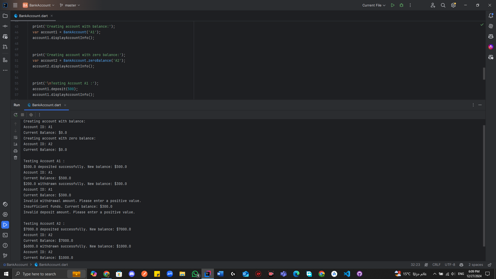

# Dart BankAccount Class

This Dart program defines a `BankAccount` class to manage basic banking operations such as deposit and withdrawal.

## How to Run

1. Ensure you have Dart installed on your machine.
2. Clone the repository.
3. Navigate to the project directory.
4. Run the program using the command: `BankAccount.dart`

## Code Explanation

- `BankAccount`: A class with properties `accountID` and `balance`, and methods for deposit, withdrawal, and displaying account information.
- The `main` function demonstrates creating accounts and performing various operations, including handling insufficient balance and invalid inputs.

## Output

